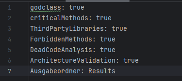
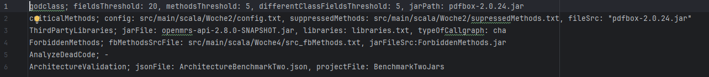
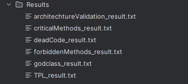
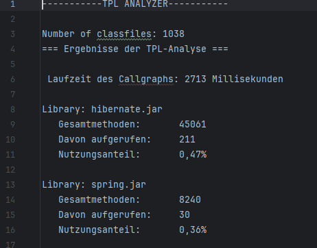

# Fachprojekt-Statische-Codeanalyse-Gruppe01

Gruppe : Maurice, Devon, Dennis

Unsere Analyse-Applikation "AktionenAuswahl" sammelt alle einzelnen Analyse Komponenten der letzten Woche

1. Godclasses 
2. Sicherheitskritische Methoden
3. Third Party Libraries (TPLs)
4. Bytecode Modifikation / Erstellung
5. Toter Code Analyse (per Abstrakter Interpretation)
6. Architektur Validierung

in einer großen Applikation. 
Eingabe und Parameter, und welche Analyse Komponenten genutzt werden sollen, werden jeweils in einer .txt Datei  
gesetzt.  

"Actions.txt" : beschreibt die benutzten Komponenten    
  
  
"Params.txt" : beschreibt die benutzten Eingabe Parameter für jede einzelne Komponente  
  
  
Für die **Godclasses**-Komponente sind die einzelnen Threshholds um eine Goddclass festzustellen, also  
* Erlaubte Felder
* Erlaubte Methoden
* Erlaubte Anzahl an fremden Feldern  
  
und der zu Dateipfad der zu analysierenden Datei konfigurierbar.  
  
  
Für **Sicherheitskritische Methoden** ist der Datei Pfad einer "config.txt" Datei anzugeben, in der die sicherheitskritischen  
Methoden, die nicht aufgerufen werden dürfen/sollen, der Pfad zu der "supressedMethods.txt", in der die Methoden stehen,  
die die kritischen Methoden aufrufen dürfen und zuletzt wieder der Pfad der zu analysierenden jar.   
  
  
Für die Analyse der **Third Party Libraries (TPLs)** der Pfad der zu analysierenden jar, eine "libraries.txt" Datei  
in der die zu findenden TPLs sind und den Typ des zu nutzenden Callgraphs.

Für die **Bytecode Modifikation** ist der Pfad zur "src_fbMethods.txt" Datei, in der alle verbotenen Methoden stehen,  
deren Inhalt ersetzt werden soll durch leeren ByteCode und der Pfad zur Jar Datei, die untersucht werden soll.  
  
Für die **Architektur Validierung** sind der Pfad des Architektur Benchmark, also das "should be" und der Pfad der  
tatsächlichen Architektur anzugeben.
  

Die Gesamtausgabe wird ins "Logs.log" gespeichert, in einer Datei.  
  
Die einzelnen Ausgaben für jede Komponente werden in "FP_01/Results" jeweils als .txt Datei ausgegeben.  
  
  
Beispielhafte .txt aus einem Durchlauf der TLP-Komponente  
  